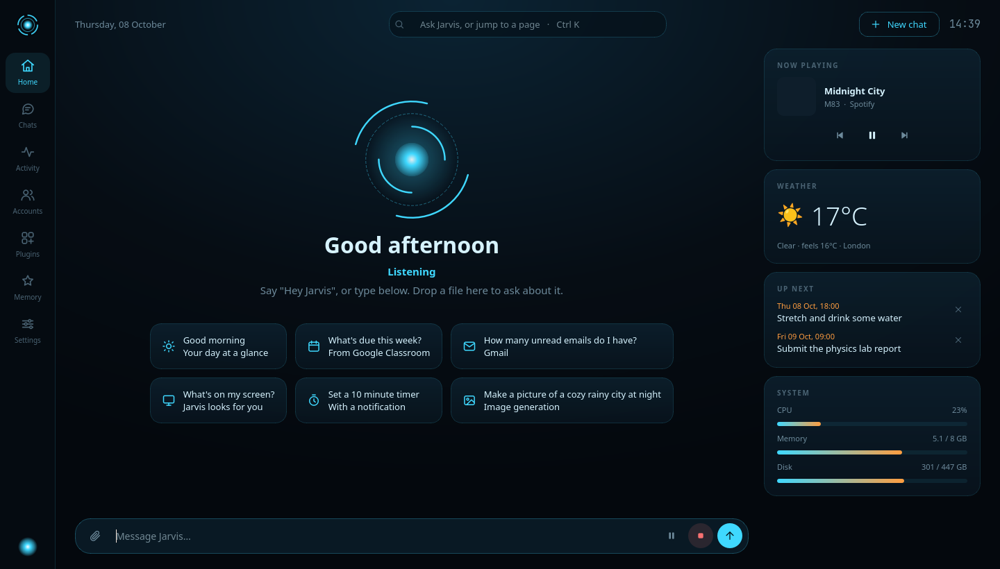
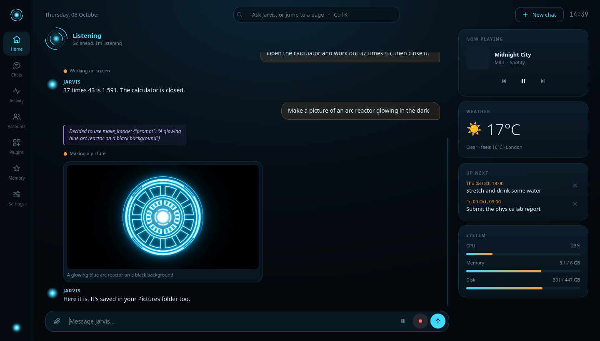
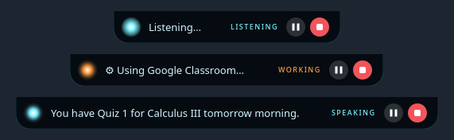

# J.A.R.V.I.S.

**A voice assistant for your PC that actually does things.** Say *"Hey Jarvis"*, talk naturally, and it answers out
loud in about a second and a half. It searches the web, reads your email and calendar, drives your desktop apps, works
websites in your own browser, sets reminders and remembers what matters to you.

It runs on **Windows 10/11** and **Linux** (X11 or Wayland: KDE Plasma, GNOME, Sway, Hyprland and others) as a tray
app with a notch at the top of the screen and a native dashboard window.







---

## Features

### Talk to it
- **"Hey Jarvis"** wakes it. The wake word is detected locally, so nothing leaves your PC until then. A notch drops
  down at the top of the screen showing what it's doing.
- **Real-time voice** with Gemini Live: it hears you directly, with no separate speech-to-text step, and speaks back.
  Follow-ups within a few seconds don't need the wake word, and long requests are fine.
- **Pause** (⏸ in the notch or chat) turns listening off or on without stopping a reply or a task. **Stop** (the red
  button, or say *"that's all"*) ends everything. Saying **"Hey Jarvis"** while it talks cuts it short.
- **Learns your voice**: real wake-ups and dismissed ones train a small verifier, so the TV stops waking it.
- **Push-to-talk**: bind `jarvis --listen` to a key. Or just type in the window.

### It does the work
- **Web**: Google-grounded search, reading any public page, YouTube search, opening links in your browser.
- **Your accounts** (through [Composio](https://composio.dev)): Gmail, Google Calendar, Classroom, Tasks, Drive,
  GitHub, Trello, Slack, Notion, Discord and more, each connected with one click.
- **Your desktop**: opens apps and presses their buttons by name through the accessibility interface (AT-SPI on Linux,
  UI Automation on Windows). It reads the screen, clicks things it finds by description, types, uses shortcuts and
  manages windows.
- **Shell**: runs commands for you (bash on Linux, PowerShell on Windows): volume, files, system info, the clipboard.
- **Background agent**: long jobs (many-step websites, forms) run in the background while you keep talking.
- **Memory and reminders**: *"Remember that I prefer short answers"*, *"Remind me in 20 minutes to stretch"*.
- **Pictures and files**: *"Make a picture of a rainy city at night"*. You can also drop a PDF, picture or text file on
  the window and ask about it.
- **Your day**: *"Good morning"* gives a briefing (weather, work due, calendar, unread email, reminders).
- **Plugins**: add any [MCP](https://modelcontextprotocol.io) server, by URL or as a local command, and Jarvis gains
  its tools.

### The window
A native Qt app. **Home** is the conversation under the animated arc reactor, with a **Today** column: now playing,
weather, what's next and system load. Other pages: **Chats** (saved and searchable), **Activity**, **Accounts**,
**Plugins**, **Memory** and **Settings**. Press **Ctrl+K** to jump anywhere or ask anything.

---

## Install

You need a free [Google AI Studio API key](https://aistudio.google.com/apikey). Image generation and some search
features need a paid key; everything else works on the free tier.

### Windows

```powershell
git clone https://github.com/Qssaf/jarvis-assistant
cd jarvis-assistant
powershell -ExecutionPolicy Bypass -File .\install.ps1
notepad $env:APPDATA\Jarvis\env      # write: GEMINI_API_KEY=your-key
```

Then start **Jarvis** from the Start Menu and say *"Hey Jarvis"*.

### Linux

Install [`uv`](https://docs.astral.sh/uv/), then:

```bash
git clone https://github.com/Qssaf/jarvis-assistant && cd jarvis-assistant
./install.sh
echo 'GEMINI_API_KEY=your-key' > ~/.config/jarvis/env && chmod 600 ~/.config/jarvis/env
```

Then start **Jarvis** from the app menu (or run `jarvis`). `install.sh` lists any system packages your desktop is
still missing:

| Needed for | Packages |
|---|---|
| Microphone and speaker | PipeWire (most distros), or PortAudio (`libportaudio2` / `portaudio`) |
| Pressing app buttons by name | `python3-gi` + `gir1.2-atspi-2.0` (Debian/Ubuntu), `python-gobject` + `at-spi2-core` (Arch, Fedora) |
| Mouse and keyboard on Wayland | [`wdotool`](https://github.com/jinliu/wdotool), or `ydotool` (typing only) |
| Windows on KDE Wayland | [`kdotool`](https://github.com/jinliu/kdotool) |
| Screenshots on Wayland | KDE: `spectacle` (or a 30 ms helper `install.sh` builds with gcc and glib headers); GNOME: `gnome-screenshot`; wlroots: `grim` |
| Clipboard | `wl-clipboard` (Wayland) or `xclip` (X11) |
| JavaScript-heavy pages (optional) | `chromium` or `google-chrome` |

On X11, input, windows and screenshots work with nothing extra. On Wayland, the notch needs XWayland to sit exactly at
the top of the screen.

### First run
- **Mouse and keyboard on Wayland**: the first time Jarvis clicks or types, your desktop may ask whether it may control
  input. Allow it (tick *Always allow* if offered).
- **Accounts**: open **Accounts** and press Connect, or just say *"Connect my Google Calendar"*.
- **Start at login**: Settings → *Start Jarvis when I log in*.

## Usage tips
- Say *"stop listening"* or *"that's all"* to end a conversation. The connection stays warm for two minutes, so the next
  "Hey Jarvis" answers instantly.
- If it cuts you off mid-sentence, raise **Settings → Pause before Jarvis answers**. If it wakes up by itself, raise
  **Wake word sensitivity** a little.
- On speakers, Jarvis doesn't hear itself while it talks, so start talking a moment after it finishes, or use
  headphones. Linux with PipeWire can also turn on **Echo cancelling** (Settings, experimental).
- Everything is logged with timings in Jarvis's data folder (`jarvis.log`).

## Models

| Part | Model |
|---|---|
| Voice | `gemini-3.8-live` |
| Reading the screen | Gemini 3.8 Flash |
| Finding where to click | Gemini 3.5 Flash Lite (trained on Gemini's 0–1000 grid; fast and accurate) |
| Web search | Gemini 3.5 Flash Lite with Google Search grounding |
| Pictures | Gemini 3.1 Flash Image (paid key) |
| Background agent | Gemini 3.8 Flash, then fallbacks: set the order in **Settings → Agent models** |

Busy or rate-limited models are skipped automatically.

**Your own backends**: create `local_backends.py` next to `jarvis.py` (it's gitignored) to add another model provider.
It's imported at startup and can register itself:

```python
import brain

class MyBackend:
    def generate(self, contents, model, thinking, tools=None, system=None, **options):
        ...  # return the reply's parts in Gemini's format

brain.BACKENDS["mine"] = MyBackend
brain.LOOK_MODELS.insert(0, ("mine", "some-model", "low"))
```

Then write `mine some-model low` in **Settings → Agent models**.

## Privacy and security
- Audio only leaves your PC after the wake word (or Talk / push-to-talk), and goes to Google's Gemini API.
- The local server only opens the window or starts listening, and only for Jarvis itself: a secret token per run plus a
  Host check.
- Jarvis's data folder, logs, tokens and conversations are private to your user.
- The page reader only fetches public internet addresses (never your PC or local network), and the headless browser
  starts with a blank profile.
- Text from web pages, emails and the screen is treated as information, not instructions. Jarvis confirms out loud
  before sending, posting, deleting or buying anything.

## Files

```
jarvis.py        tray app, wake word, Gemini Live session, notch, local API
brain.py         the agent: models, tools, accounts (Composio), plugins (MCP), Photopea
system.py        everything OS-specific: audio, screenshots, input, windows, apps, notifications
window.py        the native app window      icons.py   its line icons
store.py         settings, plugins, memory, reminders and sessions on disk
atspi_helper.py  presses app controls by name on Linux (runs under the system Python)
jarvis-shot.c    the fast KDE screenshot helper (built by install.sh)
prompt.md        the agent's instructions; the voice persona is LIVE_PROMPT in jarvis.py
test_jarvis.py   self-checks: .venv/bin/python test_jarvis.py
```

Your data lives in `~/.config/jarvis` and `~/.local/share/jarvis` on Linux, and in `%APPDATA%\Jarvis` on Windows.

See [CHANGELOG.md](CHANGELOG.md) for what changed and when.
